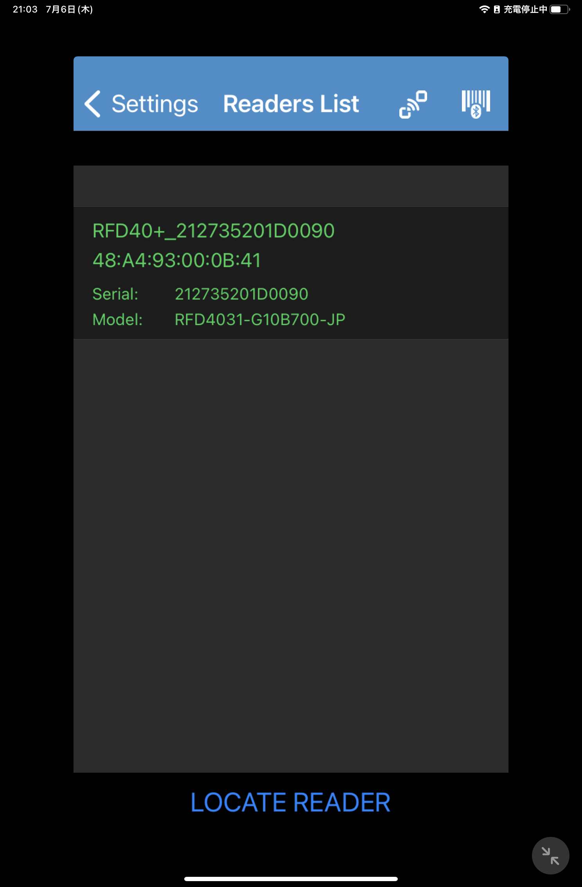
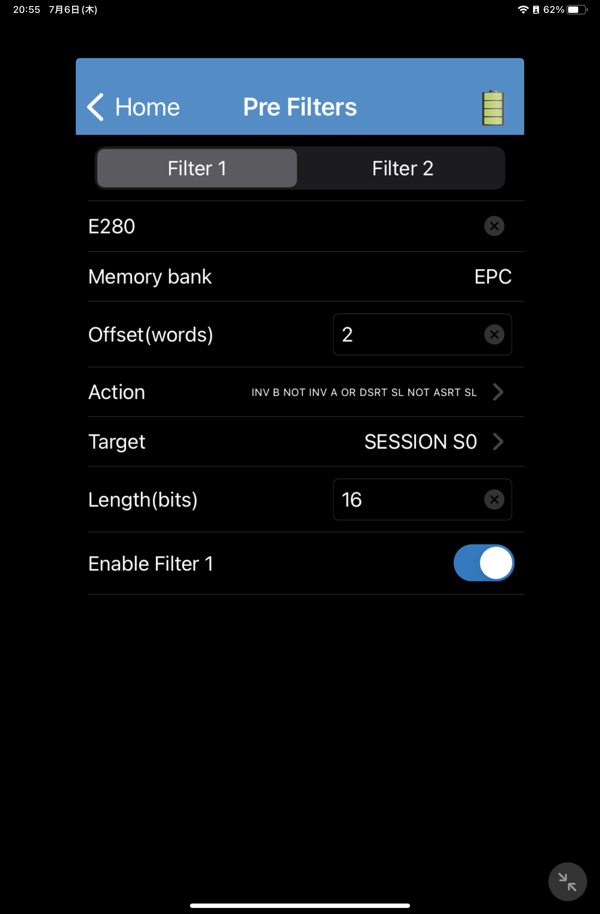
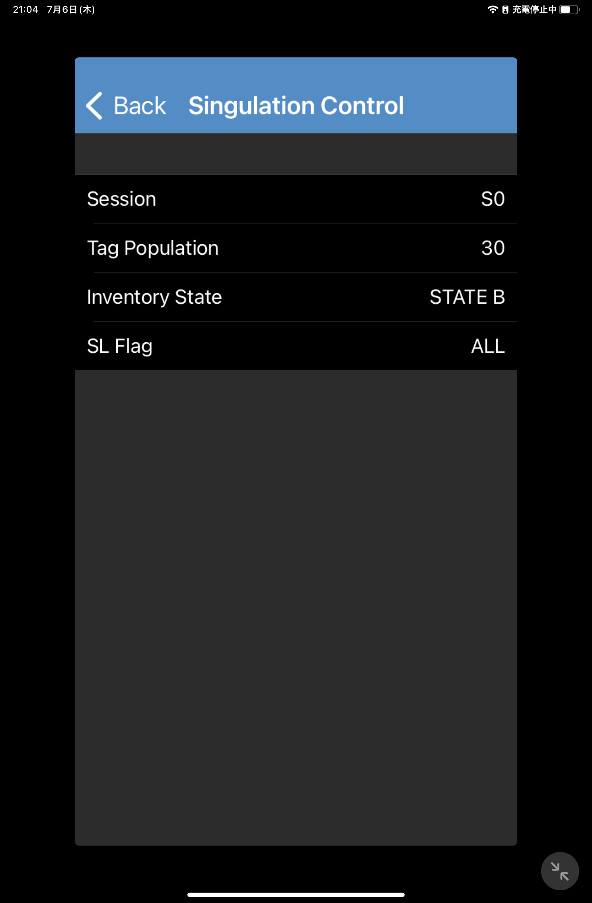
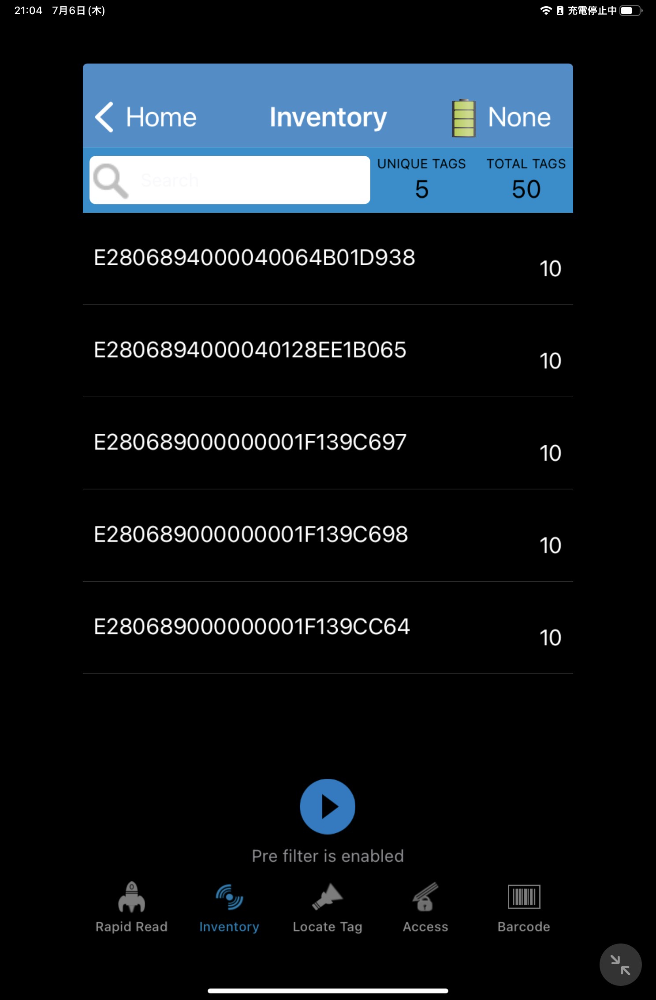

# Zebra-RFD-Reader-How to Configure Pre-Filter on 123RFID Mobile (iOS)
 123RFID Mobile-IOS版でPre-Filterを設定する方法

 

# 前提

本スレッドは123RFID for Mobikle(iOS)の2023/07/06現在の最新版(v.1.1.42)をベースに解説。解説中の写真はiOS 15.7のものを利用。お手元の123RFIDやiOSのバージョンが異なる場合はそれぞれのバージョンに合わせて読み進めること。

 

# 手順

1. AppStoreから123RFID Mobile （以降123RFID）をインストールする。

    https://apps.apple.com/us/app/zebra-rfid/id996761433?l=ja

     

1. 123RFIDを起動する。

     

1. Zebra RFDリーダをペアリングする。

     

1. 123RFIDにてご利用のRFDリーダを選択する。RFDリーダは [Readers List]にて選択可能。

    "Home" > "Settings" > "Readers List" > "ご利用のリーダ"を選択

    

     

1. [Pre Filter]にて任意の設定をする。

    "Home" > "Pre-Filters" を選択

     

    各項目については下記を参考にすること。

     

    >できるだけわかりやすい説明を心がけていますが、内容の理解についてはRFIDの専門知識が必要です。

    | 項目 | 説明 | 入力例* |
    |-|-|-|
    | Tag Pattern   | フィルタリングしたいデータパターン[Hex] をword (16bit)単位で入力    | E280
    | Memory bank   | フィルタリング対象のデータ領域を選択  | EPC
    | Offset        | "Tag Pattern" のフィルタ開始位置をword単位で入力 | 2
    | Action        | "INV B Not INV A or DSRT SL not ASRT SL" を選択   | "INV B Not INV A or DSRT SL not ASRT SL"
    | Target        | 任意のセッションを選択    | S0
    | Length        | "Tag Pattern" のデータ長をbit単位で入力 | 16bit
    | Enable Filter x | フィルタを有効化・無効化する    | スイッチ（右）

    * "E280"から開始されるタグをフィルタリングする設定例となります。

     

    

     

1. "Inventory State"の設定をする。

    "Home" > "Advanced Reader Options" > "Singulation Control" > "Inventory state" > "STATE B"を選択

    

     

1. "Home" > "Inventory" にてタグの読み取りを実施し、任意のタグのみが表示されていることを確認する。

    ▼ "E280"から開始されるタグのみを表示した例

    

     

1. 想定通りの動作をしない場合はFactory Resetを実施の上、再度本手順をはじめから実施してみてください。

    "Home" > "Factory Reset" 

